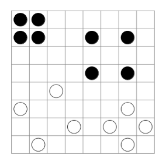

# Квадраты (Squares Game)

## Описание проекта

"Квадраты" - это стратегическая игра для двух игроков, где цель первым построить квадрат из фишек своего цвета на игровом поле размером N×N клеток.

## Структура проекта

Проект состоит из трех основных модулей:
- **squares-engine** - ядро игры на Java
- **squares-service** - бэкенд сервис на Spring Boot
- **squares-web** - веб-интерфейс на Express.js

## Технологии

- **Backend**: Java 21, Spring Boot 3, Gradle
- **Frontend**: JavaScript, Express.js, HTML5, CSS3
- **Запуск**: npm scripts, concurrently

## Требования

- Java 21
- Node.js 22
- npm 10

## Установка и запуск

1. **Клонируйте репозиторий**:
    ```bash
    git clone https://github.com/superngb3000/squares-game.git
    cd squares-game
    ```
2. **Запуск проекта**:
    ```bash
    npm run full
    ```
    Эта команда автоматически:
   - Соберет Java модули с помощью Gradle 
   - Запустит Spring Boot сервис 
   - Запустит Express.js веб-сервер
   - Откроет веб-интерфейс игры в браузере

## Правила игры

### Цель игры

Первым построить квадрат из четырех фишек своего цвета на игровом поле.

### Подготовка

1. Выбор размера поля:

   В интерфейсе выберите размер игрового поля (минимальный размер поля 3×3 клеток)

2. Выбор типа игроков:

   Для каждого цвета фишек (Белые и Черные) выберите тип игрока:

   - Человек - управление через интерфейс 
   - Компьютер - автоматические ходы

3. Запуск игры:

   Нажмите кнопку "New Game" для начала новой игры

### Ход игры

1. Игроки ходят по очереди
2. За один ход игрок ставит одну фишку своего цвета в любую свободную клетку 
3. Ход нельзя пропускать

### Условия победы

Игрок побеждает, если первым выстраивает квадрат из четырех фишек своего цвета. Квадрат может быть:

- Любого размера
- В любой ориентации (горизонтальный, вертикальный, под углом)
- В любом месте поля

### Примеры квадратов


### Ничья

Если все клетки на поле заполнены, но ни один игрок не смог построить квадрат, объявляется ничья.
